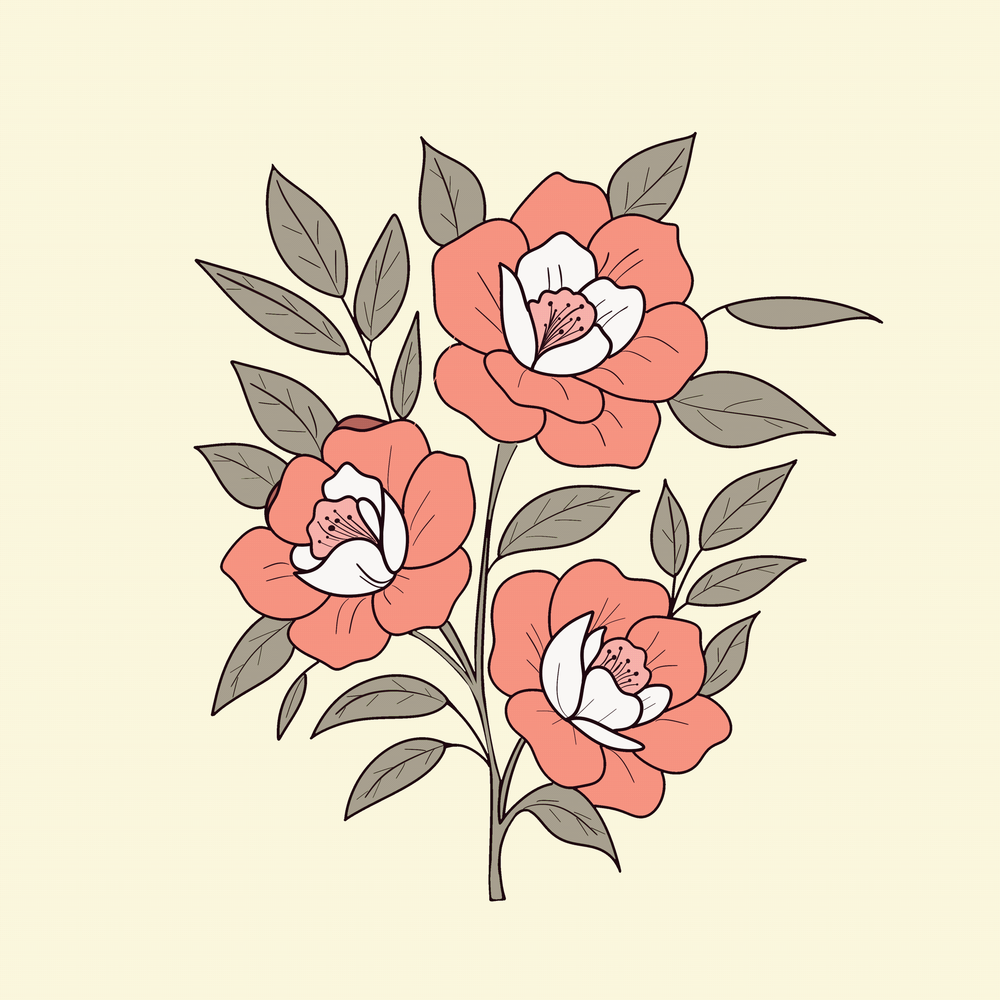
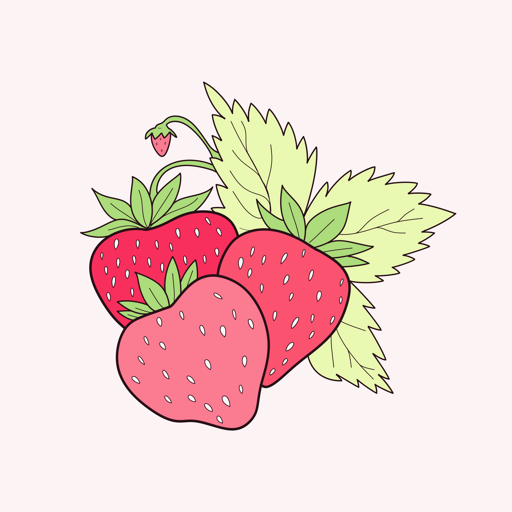
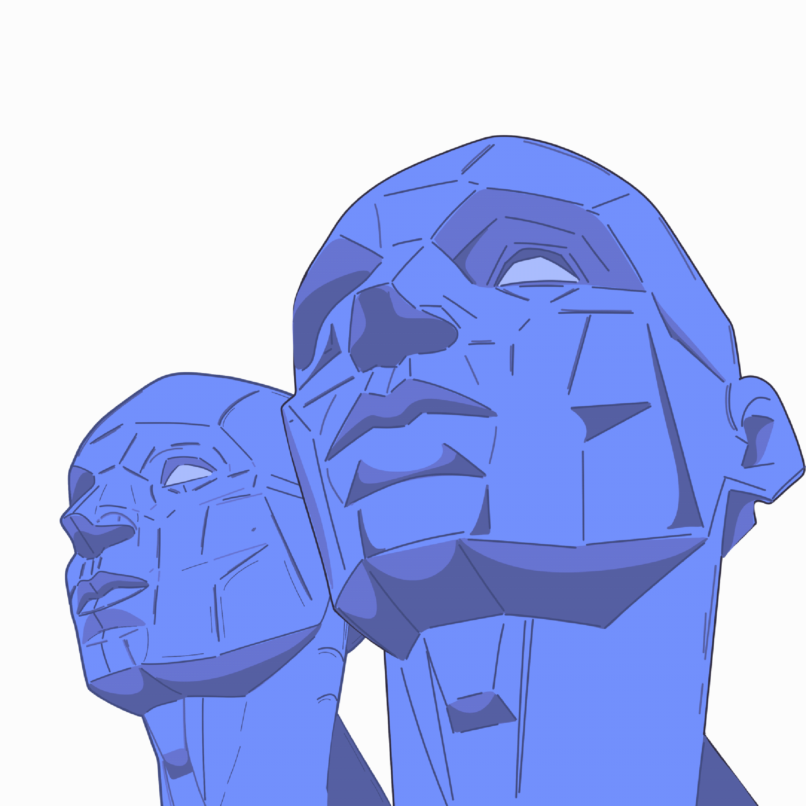

<h1 align="center">Hi there 👋, I'm Cansu Sarp</h1>

  Mobile Developer | Technical Analyst | UI/UX Enthusiast  
  <a href="https://cansusarp.com">🌐 Website</a> •
  <a href="https://linkedin.com/in/cansu-sarp">🔗 LinkedIn</a> •
  <a href="https://x.com/yazilimcikedis">🐦 Twitter</a>

---

## 💫 About Me

- Passionate about mobile app development with a focus on **Flutter** and **SwiftUI**.  💻✨
- Always exploring clean and responsive **UI/UX designs**.  🔭
- Constantly learning new technologies and best practices.  🌱
- In love with creating beautiful, functional apps — and also a cat lover 🐱
- In my free time, I enjoy drawing, reading, and taking artistic photos.  😀

---

## 🛠️ Tech Stack & Tools

| Domain                  | Tools / Technologies                        |
|-------------------------|---------------------------------------------|
| Mobile Development      | Flutter, Dart, Swift, SwiftUI               |
| UI / UX Design          | Responsive Layouts, Design Principles       |
| State Management        | Provider, Riverpod (Exploring)              |
| Tools & Platforms       | Git, GitHub, VS Code, Xcode                 |
| Other Interests         | Art, Photography, Creative Writing          |

---

## 📌 Featured Projects

Here are some of the projects I'm proud to share (check my pinned repos!):

- 🛒 **grocery_app** — Modern UI for a grocery shopping app *(Flutter)*
- 💳 **fintech_app** — A clean and minimal fintech mobile interface
- 🔄 **placeholder** — JSON API integration example in Flutter
- 🔐 **auth_provider** — Authentication using Flutter & Provider

> 💡 Most of my projects are focused on **UI design and practical state management** in Flutter.

---

## 🤝 Let's Connect

I'm always open to:

- Collaboration on exciting mobile projects  
- Contributions to open-source UI kits  
- Chatting about software, design, or creativity!

**Reach out here:**

- 📬 [LinkedIn](https://linkedin.com/in/cansu-sarp)  
- 🐦 [Twitter / X](https://x.com/yazilimcikedis)  
- 🌐 [Website](https://cansusarp.com)

---

## 🧩 Fun Fact

> “Code is how I turn ideas into reality — and cats make the debugging process better.” 🐾

---

  
  
  

  
  
    

/>

  Thank you for visiting my profile 💜

